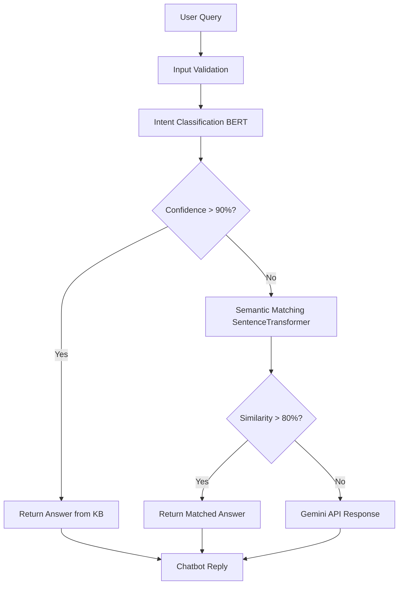

# 🧠 Cancer-Aware Medical Chatbot using Bio_ClinicalBERT

[](https://www.python.org/downloads/)
[](https://flask.palletsprojects.com/)
[](https://pytorch.org/)
[](https://huggingface.co/transformers/)
[](https://opensource.org/licenses/MIT)

> A cancer-specialized chatbot using Bio_ClinicalBERT for intent classification, sentence-transformer for fallback matching, and Gemini API for open-ended queries.

---

## 🔍 Overview

This chatbot is designed to answer **cancer-related medical questions** using a **trained Bio_ClinicalBERT model**, a **semantic search fallback**, and **AI-generated responses** for unknown queries.

---

## ✅ Features

- 🔬 Fine-tuned Bio_ClinicalBERT for intent classification  
- 🧠 100+ cancer-focused medical intents in a curated JSON knowledge base  
- 🔍 Semantic fallback using `all-MiniLM-L6-v2`  
- 🤖 Gemini API integration for advanced AI responses  
- 🧾 Clean Flask API with HTML frontend  
- 🔐 Input validation and sanitization  

---

## 🧱 Project Structure

```
cancer-chatbot/
├── app.py                          # Flask backend (API + Web UI)
├── chatbot.py                      # Core chatbot logic (classifier + fallback)
├── model.py                        # Model training pipeline
├── gemini_config.py                # Gemini API setup for fallback
├── cancer_knowledge_base.json      # Medical Q&A knowledge base
├── fold3_best_model.pth            # Trained model weights
├── tag2idx.pickle                  # Tag-to-index mapping
├── idx2tag.pickle                  # Index-to-tag mapping
├── templates/
│   └── index.html                  # HTML frontend
├── requirements.txt
└── README.md
```

---

## ⚙️ Setup Instructions

### 1️⃣ Clone and Install

```bash
git clone https://github.com/your-username/cancer-chatbot.git
cd cancer-chatbot

python -m venv venv
source venv/bin/activate  # Windows: venv\Scripts\activate

pip install -r requirements.txt
```

### 2️⃣ Configure Environment
Create a `.env` file and add:

```bash
GEMINI_API_KEY=your_gemini_api_key
```

### 3️⃣ Run the Chatbot
```bash
python app.py
```

Visit **http://127.0.0.1:5000**

---

## 🧠 How It Works



---

## 🧪 API Usage

**POST** `/chat`

**Request:**
```json
{
  "message": "What are the symptoms of liver cancer?"
}
```

**Response:**
```json
{
  "response": "Common symptoms include weight loss, fatigue, jaundice...",
  "source": "intent_classifier"
}
```

**Response Sources:**
- `"intent_classifier"` — confident prediction
- `"semantic_match"` — similar question matched  
- `"gemini"` — AI-generated fallback

---

## 🧠 Training the Model

To retrain the intent classifier using your JSON KB:

```bash
python model.py
```

This will:
- Train Bio_ClinicalBERT on all patterns in the JSON
- Save the model as `fold3_best_model.pth`
- Generate `tag2idx.pickle` and `idx2tag.pickle`

---

## ➕ Add New Medical Intent

Just append to `cancer_knowledge_base.json` like:

```json
{
  "tag": "lung_cancer_treatment",
  "patterns": [
    "How is lung cancer treated?",
    "Treatment options for lung cancer"
  ],
  "answer": "Lung cancer is treated with surgery, chemo, radiation, and immunotherapy."
}
```

Then run:
```bash
python model.py
```

---

## ⚠️ Disclaimer

This chatbot is intended only for **educational and informational use**. It is not a substitute for professional medical advice. Always consult a licensed healthcare provider for diagnosis or treatment.

---

## 📄 License

This project is licensed under the MIT License.

---

## 🙌 Acknowledgments

- **Bio_ClinicalBERT** – Emily Alsentzer et al.
- **HuggingFace Transformers**
- **Sentence-Transformers**
- **Gemini API** – Google AI

---

**⭐ Star this repo if you find it helpful!**
